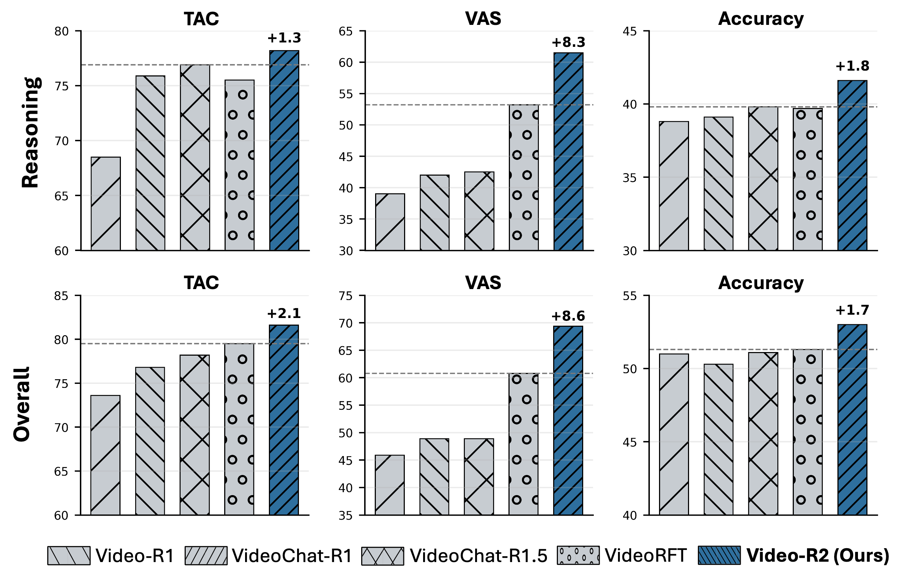

# Video-R2: Reinforcing Consistent and Grounded Reasoning in Multimodal Language Models

<!--  -->
<p align="center">
    
</p>
 
#### [Muhammad Maaz](https://www.mmaaz60.com), [Hanoona Rasheed](https://github.com/hanoonaR), [Fahad Shahbaz Khan](https://sites.google.com/view/fahadkhans/home), [Salman Khan](https://salman-h-khan.github.io/)

#### **MBZUAI, Linköping University, Australian National University**
 
[](https://arxiv.org/abs/2511.23478)
[](https://huggingface.co/collections/MBZUAI/video-r2)


**🔥🔥 Update:** We release the **code** (training, evaluation, demo), the **final Video-R2 model**, and the **datasets** used in the development of Video-R2.

- **Paper:** https://arxiv.org/abs/2511.23478
- **Code:** for [evaluation](eval/README.md), [timestamp-aware SFT + GRPO](train/README.md) and [gradio demo](demo/README.md).
- **Models:** 
  - **Video-R2 (final model):** https://huggingface.co/MBZUAI/Video-R2
  - **Video-R2-SFT (after SFT):** https://huggingface.co/mmaaz60/Video-R2-SFT
- **Dataset:** https://huggingface.co/datasets/MBZUAI/Video-R2-Dataset


## Overview

Reasoning over dynamic visual content is challenging for multimodal large language models (MLLMs). While recent thinking models generate explicit reasoning traces, their reasoning can be logically inconsistent or weakly grounded in the video. Video-R2 addresses this by combining timestamp-aware supervised fine-tuning (SFT) with reinforcement learning (GRPO) that encourages temporally aligned and causally coherent video reasoning.

In the paper, we propose two diagnostic metrics:

- **Think-Answer Consistency (TAC):** alignment between the generated reasoning and the final answer.
- **Video Attention Score (VAS):** extent to which the model's reasoning relies on video evidence rather than linguistic priors or world knowledge.


**Inconsistent reasoning in prior video LLMs and improved visual reliance with Video-R2.**  
Given the video and the question *“How many transactions does Visa have in one day?”* both **Video-R1** and **VideoChat-R1** conclude option A during their reasoning but ultimately predict option E, showing that the model’s reasoning and final answer do not match. This behavior occurs because these models rely heavily on textual context and prior knowledge while attending weakly to the video. In contrast, **Video-R2** correctly identifies the on screen visual cue at `01:45` (*“23,666 transactions/sec”*), performs temporal conversion, and arrives at the correct daily value. The box plot on the right shows the average attention from generated tokens to video tokens across all attention heads in the final transformer layer. Compared with baselines, **Video-R2** assigns higher and more distributed attention to video tokens, indicating stronger and more adaptive visual reliance. While earlier models often produce plausible yet inconsistent reasoning, **Video-R2** reasons coherently and grounds its decisions in actual video evidence.

---



**Comparison of Video-R2 with recent video reasoning models, Video-R1, VideoChat-R1/1.5, and VideoRFT, across three metrics: TAC (Think–Answer Consistency), VAS (Video Attention Score), and Accuracy.**
The upper row reports average scores over six reasoning benchmarks, `VideoMathQA, Video-MMMU, MMVU, VSIBench, MINERVA, and SciVideoBench`, while the lower row shows averages over all 11 benchmarks including the five generic ones, `MVBench, VideoMME, TempCompass, MLVU, and LongVideoBench`. Video-R2 performs better across both reasoning and overall evaluations, achieving higher consistency (TAC) and video-focused reasoning
(VAS) while maintaining competitive accuracy.


## Repository structure

- `train/`: two-stage post-training (SFT then GRPO) and utilities
- `eval/`: unified evaluation pipeline, accuracy, TAC and VAS scripts
- `demo/`: simple Gradio demo for the released `MBZUAI/Video-R2` model

## Installation

A minimal environment for demo and evaluation:

```bash
conda create -n video-r2 python=3.12 -y
conda activate video-r2
pip install -U pip

# We use torch v2.7.0, torchvision v0.22.0 and transformers v2.51.1 in the development of Video-R2
# Please see requirements.txt and environment.yml for all requirements
pip install -r requirements.txt

# Evaluation deps
# We use lmms-eval framework for our evaluation pipeline
cd eval/lmms-eval
pip install -e .
cd ../..
```

## Quickstart

### Demo

```bash
cd demo
python gradio_demo.py --ckpt MBZUAI/Video-R2 --port 7860
```

### Evaluation

See `eval/README.md` for the full reproduction pipeline. For a one-command accuracy run across all 11 benchmarks:

```bash
bash eval/scripts/accuracy/run_all.sh
```

### Training

See `train/README.md` for details.

```bash
bash train/scripts/train_sft.sh
bash train/scripts/train_grpo.sh
```


## Acknowledgements 🙏🏼

We thank the open-source community for providing excellent tools and models that enabled this research. We particularly thank:
1. Qwen team for providing [Qwen-2.5VL-Instruct](https://huggingface.co/Qwen/Qwen2.5-VL-7B-Instruct) model.
2. lmms-eval - https://github.com/EvolvingLMMs-Lab/lmms-eval for providing easy to modify MLLM evaluation framework.
3. 2U1/Qwen-VL-Series-Finetune - https://github.com/2U1/Qwen-VL-Series-Finetune for providing easy to use base training scripts for Qwen-VL series.

## Citation ✏️

If you find Video-R2 helpful, please cite:

```bibtex
@article{maaz2025video-r2,
  title={Video-R2: Reinforcing Consistent and Grounded Reasoning in Multimodal Language Models},
  author={Maaz, Muhammad and Rasheed, Hanoona and Khan, Fahad Shahbaz and Khan, Salman},
  journal={arXiv preprint arXiv:2511.23478},
  year={2025}
}
```

---

[](https://www.ival-mbzuai.com)
[](https://github.com/mbzuai-oryx)
[](https://mbzuai.ac.ae)
