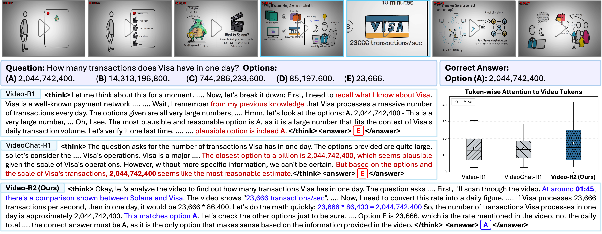

# Video-R2: Reinforcing Consistent and Grounded Reasoning in Multimodal Language Models

<!--  -->
<p align="center">
    
</p>
 
#### [Muhammad Maaz](https://www.mmaaz60.com), [Hanoona Rasheed](https://github.com/hanoonaR), [Fahad Khan](https://sites.google.com/view/fahadkhans/home), [Salman Khan](https://salman-h-khan.github.io/)
 
#### **MBZUAI, Linköping University, Australian National University**
 
[](TBD)


---

**Inconsistent reasoning in prior video LLMs and improved visual reliance with Video-R2.**  
Given the video and the question *“How many transactions does Visa have in one day?”* both **Video-R1** and **VideoChat-R1** conclude option A during their reasoning but ultimately predict option E, showing that the model’s reasoning and final answer do not match. This behavior occurs because these models rely heavily on textual context and prior knowledge while attending weakly to the video. In contrast, **Video-R2** correctly identifies the on screen visual cue at `01:45` (*“23,666 transactions/sec”*), performs temporal conversion, and arrives at the correct daily value. The box plot on the right shows the average attention from generated tokens to video tokens across all attention heads in the final transformer layer. Compared with baselines, **Video-R2** assigns higher and more distributed attention to video tokens, indicating stronger and more adaptive visual reliance. While earlier models often produce plausible yet inconsistent reasoning, **Video-R2** reasons coherently and grounds its decisions in actual video evidence.

---

## Abstract

Reasoning over dynamic visual content remains a central challenge for multimodal large language models. Recent thinking models generate explicit reasoning traces for interpretability, but their reasoning often appears convincing while being logically inconsistent or weakly grounded in visual evidence. We identify and formalize these issues through two diagnostic metrics: **Think–Answer Consistency (TAC)**, which measures the alignment between reasoning and answers, and **Video Attention Score (VAS)**, which captures how much the reasoning depends on visual rather than textual cues. Analysis across **11 video reasoning benchmarks** shows that current models rely heavily on linguistic priors instead of visual content. To address this, we propose a reinforcement learning approach that enhances temporal precision and reasoning consistency. Our approach combines timestamp aware supervised fine tuning with Group Relative Policy Optimization guided by a new **Temporal Alignment Reward (TAR)**. This dual stage post training process promotes temporally aligned and causally coherent video reasoning. The resulting model, **Video-R2**, achieves consistently higher TAC, VAS, and accuracy across multiple benchmarks, showing that improvements in temporal alignment and reasoning coherence lead to more accurate and trustworthy video understanding.

---

## Method Overview

**Video-R2** improves video reasoning through:

1. **Timestamp aware SFT**  
   Trains the model to generate structured reasoning with explicit temporal cues.

2. **Temporal Alignment Reward (TAR)**  
   Encourages reasoning steps that align with visual events at the correct timestamps.

3. **Consistency Gate**  
   Rewards temporal alignment only when the reasoning and final answer match.

The resulting model **Video-R2**, produces coherent, visually grounded, and accurate reasoning traces.

---

## Model, Data, and Code

The model, data and training/evaluation codes will be released soon. Stay tuned! 🚀

---

## Citation

If you find Video-R2 helpful in your research, please cite:

```bibtex
@article{maaz2025video-r2,
  title={Video-R2: Reinforcing Consistent and Grounded Reasoning in Multimodal Language Models},
  author={Maaz, Muhammad and Rasheed, Hanoona and Khan, Fahad Shahbaz and Khan, Salman},
  journal={arXiv preprint arXiv:xxxx.xxxxx},
  year={2025}
}
```

---

[](https://www.ival-mbzuai.com)
[](https://github.com/mbzuai-oryx)
[](https://mbzuai.ac.ae)