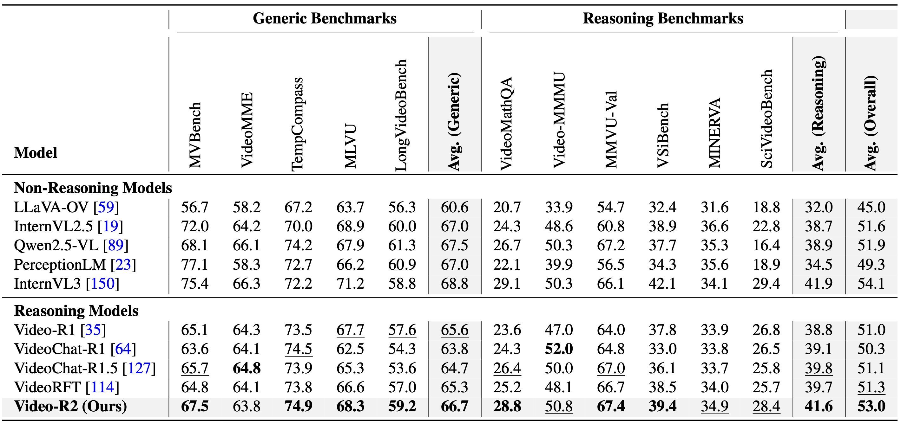
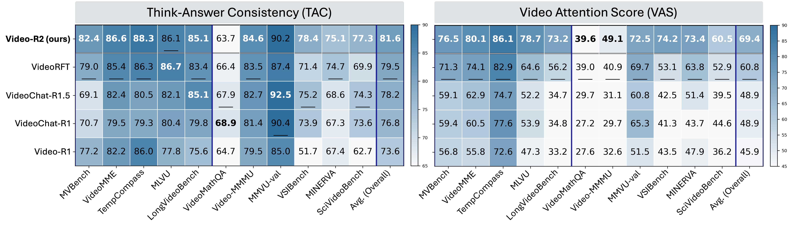
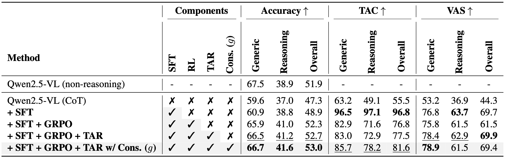

# Evaluation

This folder contains the unified evaluation pipeline used in the Video-R2 project.

We evaluate Video-R2 on **11 benchmarks** using a unified protocol:

- **5 general-purpose (non-reasoning) benchmarks:** MVBench, VideoMME, TempCompass, MLVU, LongVideoBench
- **6 reasoning-focused benchmarks:** VideoMathQA, Video-MMMU, MMVU, VSIBench, MINERVA, SciVideoBench

Evaluation follows the same high-level flow as in the paper:

1. **Accuracy**: run inference to generate predictions for each benchmark
2. **TAC**: compute Think-Answer Consistency by parsing the final answer and checking alignment with the model's reasoning
3. **VAS**: compute Video Attention Score to measure reliance on video evidence during reasoning

## Layout

- `lmms-eval/`
  - A modified version of the LMMS-Eval framework used to run all benchmarks.
- `scripts/accuracy/`
  - Inference script (accuracy across all benchmarks).
- `scripts/tac/`
  - TAC computation (uses an LLM to extract the final answer from the reasoning trace).
- `scripts/vas/`
  - VAS computation.
- `scripts/post_processing/`
  - Utilities for post-processing.

## 1) Setup

### 1.1 Install dependencies

From the repository root:

```bash
conda create -n video-r2 python=3.12 -y
conda activate video-r2
pip install -U pip

# We use torch v2.7.0, torchvision v0.22.0 and transformers v2.51.1 in the development of Video-R2
# Please see requirements.txt and environment.yml for all requirements
pip install -r requirements.txt

# Evaluation deps
# We use lmms-eval framework for our evaluation pipeline
cd eval/lmms-eval
pip install -e .
cd ../..
```

### 1.2 Configure Hugging Face cache and token

The benchmarks' datasets are pulled through the Hugging Face datasets cache. The provided scripts expect:

- `HF_HOME`: your Hugging Face cache directory
- `HF_TOKEN`: a Hugging Face token (only required if a dataset requires authentication)

Example:

```bash
export HF_HOME=/path/to/hf_cache
export HF_TOKEN=<your_token>
```

## 2) Download the model

We release the final model on Hugging Face:

- https://huggingface.co/MBZUAI/Video-R2

You can either reference it by name or download it locally:

```bash
hf download MBZUAI/Video-R2
```


## 3) Reproduce Accuracy (Main Results)

We provide a single script that runs inference for all 11 benchmarks:

```bash
bash eval/scripts/accuracy/run_all.sh
```

Before running, edit `eval/scripts/accuracy/run_all.sh` and set:

- `HF_HOME` and `HF_TOKEN`
- `CHECKPOINTS_PATH` (default is `MBZUAI/Video-R2`)
- `NUM_GPUS`
- `FPS_MAX_FRAMES` (default 128)

Outputs are written under:

```text
<CKPT>/eval_think_<FPS_MAX_FRAMES>/
  <task_name>/
    ... predictions and evaluation artifacts ...
```

This directory will be the input for TAC and VAS.

## 4) Compute TAC

TAC requires parsing the final answer from the model's reasoning trace. We use an LLM for robust answer extraction.

### 4.1 Run TAC for All Benchmarks

1) Edit `eval/scripts/tac/_run.sh` and set:

- `PREDICTIONS_DIR`: directory produced by the accuracy step
- `OUTPUT_DIR`: where TAC results will be written
- `LLM_PATH`: a judge / parsing model (default in the script is a Qwen3 instruction model)

2) Run:

```bash
cd eval/scripts/tac
bash _run.sh
```

### 4.2 Summarize TAC

```bash
python eval/scripts/post_processing/summarize_tac.py --help
```

## 5) Compute VAS

VAS measures how much the model focuses to video while producing its reasoning.

1) Edit `eval/scripts/vas/_run.sh` and set:

- `PREDICTIONS_DIR`
- `OUTPUT_DIR`
- `LLM_PATH`

2) Run:

```bash
cd eval/scripts/vas
# Note: the runner calls the Python script. If you modify the runner, ensure it points to evaluate_vas.py.
python evaluate_vas.py --help
bash _run.sh
```

3) Summarize:

```bash
python eval/scripts/post_processing/summarize_vas.py --help
```

## 6) VSIBench post-processing (LLM)

VSIBench requires an additional post-processing step to robustly convert free-form outputs into the benchmark's required formats.

We provide:

- `eval/scripts/post_processing/post_process_vsibench_predictions.py`

This script can use an LLM (via vLLM) to:

- map free-form outputs to multiple-choice letters (MCA)
- parse numeric answers (NA), including number words

Run:

```bash
python eval/scripts/post_processing/post_process_vsibench_predictions.py --help
```

## 7.1) Results Summary


**Comparison of Video-R2 with recent video reasoning models, Video-R1, VideoChat-R1/1.5, and VideoRFT, across three metrics: TAC (Think–Answer Consistency), VAS (Video Attention Score), and Accuracy.**
The upper row reports average scores over six reasoning benchmarks, `VideoMathQA, Video-MMMU, MMVU, VSIBench, MINERVA, and SciVideoBench`, while the lower row shows averages over all 11 benchmarks including the five generic ones, `MVBench, VideoMME, TempCompass, MLVU, and LongVideoBench`. Video-R2 performs better across both reasoning and overall evaluations, achieving higher consistency (TAC) and video-focused reasoning (VAS) while maintaining competitive accuracy.

---

## 7.2) Main Results



**Accuracy comparison on generic and reasoning benchmarks.**
Results are reported for both non-reasoning and reasoning models (7B/8B scale) across `five generic` and `six reasoning-focused` benchmarks. Columns list per-benchmark accuracy along with averages for generic, reasoning, and overall performance, with the best results shown in bold and the second-best results underlined in each column. Our Video-R2 achieves the highest averages across generic (66.7), reasoning (41.6), and overall (53.0), showing improved reasoning ability and balanced accuracy across multiple benchmarks.

---

## 7.3) TAC and VAS



**Reasoning quality comparison on TAC and VAS metrics.**
The left and right heatmaps show TAC and VAS across 11 benchmarks, including `five generic` and `six reasoning-focused` datasets. The rightmost columns show the overall average. The dark blue vertical line separates the generic, reasoning, and average columns. *Darker colors indicate higher scores*, with the best results in bold and the second-best underlined for all benchmarks. `Video-R2 achieves the best TAC on 8 out of 11 benchmarks and the best VAS on all 11 benchmarks` compared with previous reasoning models. Overall, the proposed temporal alignment and consistency gating improve both logical coherence (TAC) and perceptual focus (VAS) in video reasoning multimodal models.

---

## 7.4) Ablations on Key Components of Video-R2



**Ablation on key components of Video-R2.** Checkmarks denote enabled modules: supervised fine-tuning (SFT), group relative policy optimization (GRPO), Temporal Alignment Reward (TAR), and consistency gating (g). `Metrics are reported as average scores across five generic, six reasoning-focused, and all benchmarks for Accuracy, TAC, and VAS.` The results highlight the progressive improvements achieved by introducing temporal alignment and consistency gating in Video-R2.

---

## Citation ✏️

If you find Video-R2 helpful, please cite:

```bibtex
@article{maaz2025video-r2,
  title={Video-R2: Reinforcing Consistent and Grounded Reasoning in Multimodal Language Models},
  author={Maaz, Muhammad and Rasheed, Hanoona and Khan, Fahad Shahbaz and Khan, Salman},
  journal={arXiv preprint arXiv:2511.23478},
  year={2025}
}
```

---

[](https://www.ival-mbzuai.com)
[](https://github.com/mbzuai-oryx)
[](https://mbzuai.ac.ae)

